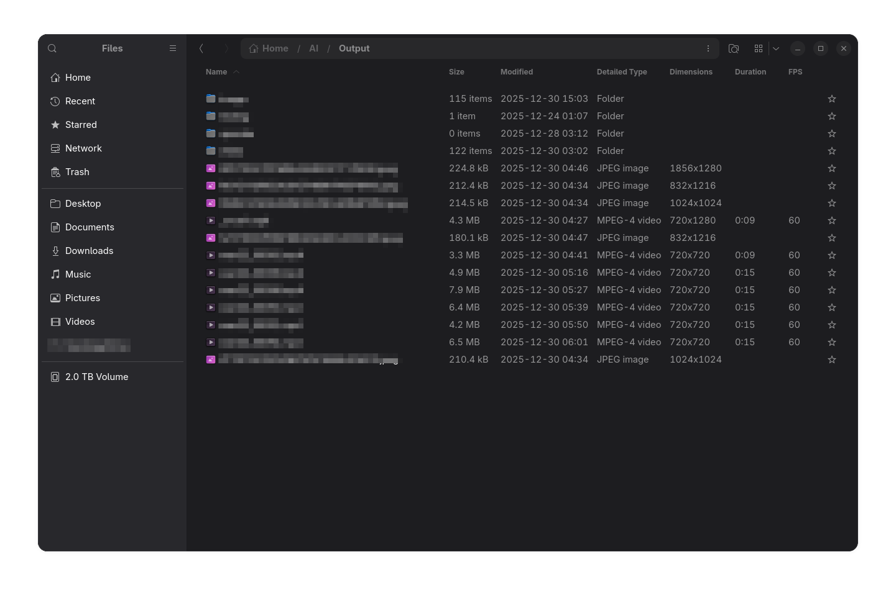

# Nautilus Media Columns

Adds **Dimensions**, **Duration**, and **FPS** (Framerate) columns to Nautilus (GNOME Files) list view for images and videos. Metadata is read using GNOME-native libraries and cached for performance.

<p align="center">
  
</p>

***

## Features

- **Dimensions**
  - Images: fast header-only probe (no full decode)
  - Videos: via GStreamer discoverer
- **Duration** (videos)
- **FPS (Framerate)** (videos, rounded to whole numbers)
- **Persistent cache**
  - SQLite (WAL mode)
  - Indexed by path; invalidated when mtime or size changes
  - Automatic pruning:
    - Time-based TTL: 90 days since last access
    - Size-based cap: 50,000 rows (least-recently-used)
- **No ffmpeg dependency**
  - Videos use GNOME-provided GStreamer
- **Image metadata**
  - Prefers GExiv2
  - Falls back to GdkPixbuf if GExiv2 is unavailable

---

## Requirements

- Python 3
- Nautilus with **nautilus-python (API 4.0)**
- GStreamer (installed by default on GNOME desktops)

```bash
# If nautilus-python is not installed...
sudo apt update && sudo apt install python3-nautilus -y
```

Tested on:
- GNOME / Nautilus 48
- Ubuntu 25.04

Expected to work on:
- Targets nautilus-python API 4.0 (GNOME 45+); expected to work but not guaranteed across all distros.

---

## Installation (per user)

```bash
mkdir -p ~/.local/share/nautilus-python/extensions
wget https://raw.githubusercontent.com/derek-shnosh/nautilus-media-columns/main/nautilus-media-columns.py \
  -O ~/.local/share/nautilus-python/extensions/nautilus-media-columns.py
nautilus -q
```

Restart Nautilus, switch to **List View**, open **Visible Columns**, and enable:
- Dimensions
- Duration
- FPS

---

## Cache

Cache database location:

```
~/.cache/nautilus-media-columns/media.sqlite3
```

Safe to delete at any time; it will be recreated automatically.

Cache behavior:
- Entries are refreshed only if **mtime or size changes**
- Cache is pruned automatically based on TTL and max-row limits
- Writes are batched to minimize I/O

---

## Supported Formats

**Images**
- PNG, JPG/JPEG, WebP, BMP, TIFF

**Videos**
- MP4, MKV, MOV, AVI, WebM, M4V

(Actual codec support depends on installed GStreamer plugins.)

---

## Performance Notes

- First visit to a folder may probe uncached files
- Subsequent visits are instant
- Probing is best-effort and cached; some files may take longer on first access.

## License

MIT
